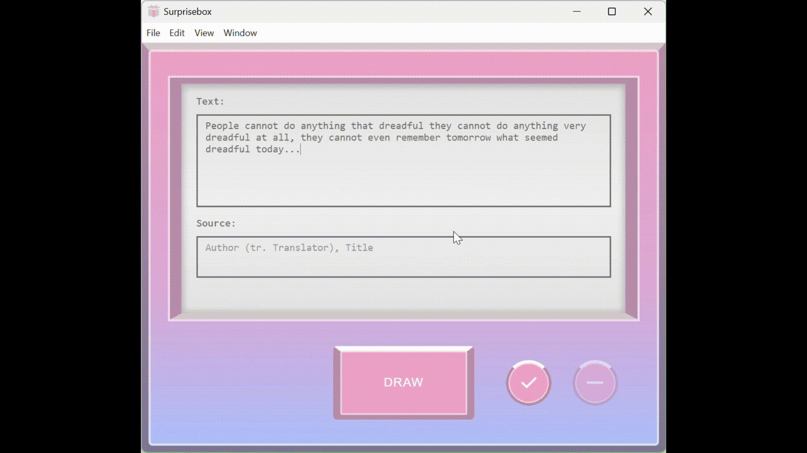

# Surprisebox

A cross-platform desktop app built using Electron allowing users to build and maintain a database of textual quotes. Each time a button is clicked, a random quote is drawn from the database and displayed. Quotes can be added and removed through the UI.

# Usage instructions
## Prerequisites
To build this app your machine must first have npm and Node.js installed. There are many ways to do this, including using a Node version manager such as [nvm](https://github.com/nvm-sh/nvm).

## To run

1. Clone this repo.
2. Run `npm install` to install dependencies.
3. Run `npm run start` to run the app.

## To build

1. First check that the platform you want to build for is included in the 'packages' field in `package.json`. If not, edit the field with the name of the platform to build for.
2. Run `npm run make` to build the app.

The produced distributable will be located in `out/make`.

# Acknowledgements

The [W3Schools Autocomplete tutorial code](https://www.w3schools.com/howto/howto_js_autocomplete.asp) was referenced in creating the autocomplete feature for the 'source' input field, which suggests matching values from all previously saved values to the current input as the user types.